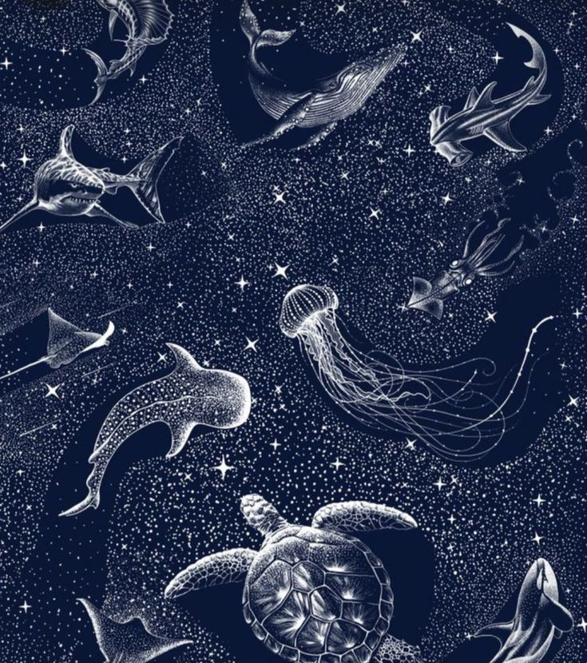
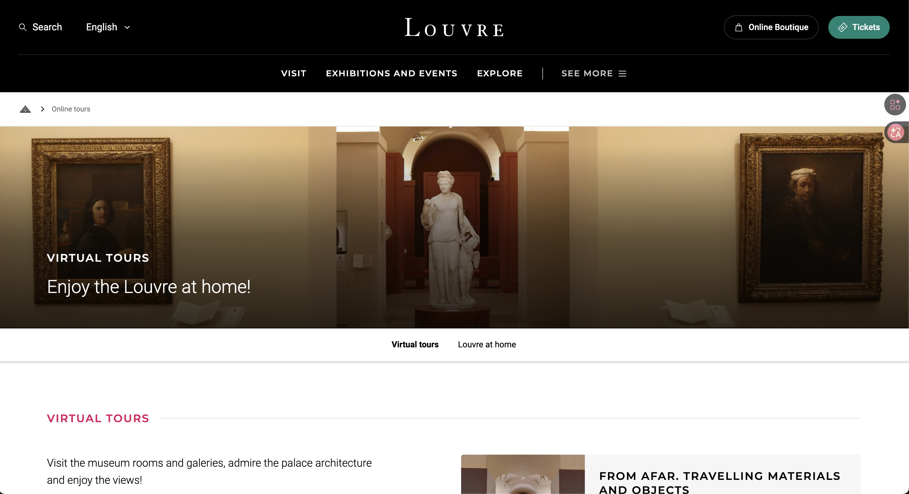
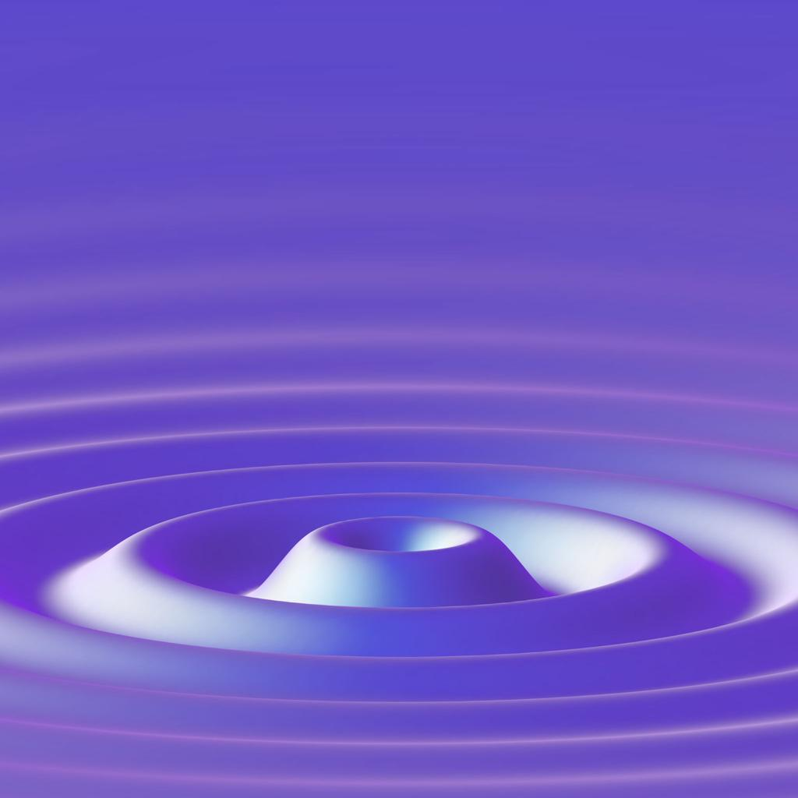
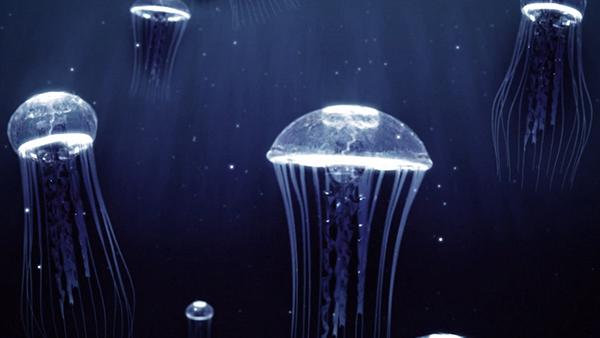
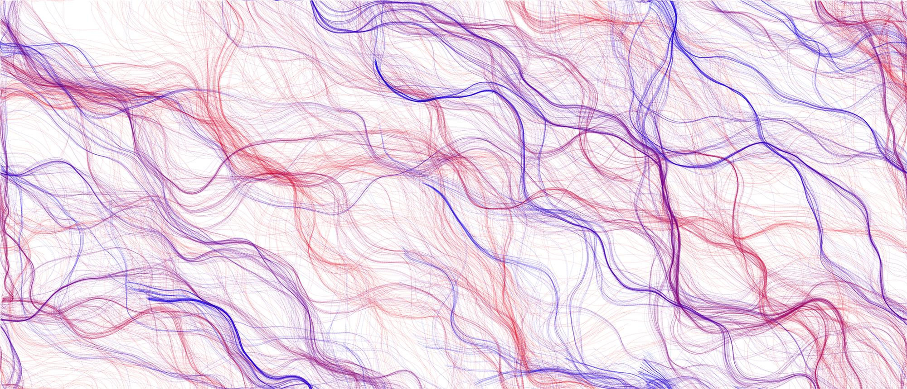
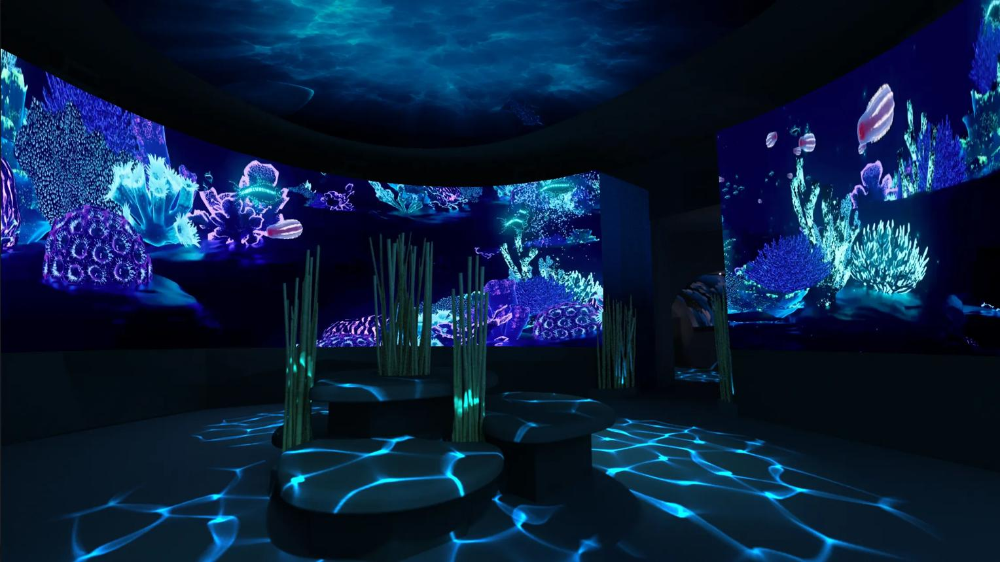

# IDEA103-Somwrita-Team-3

> Week 9 Quiz - Team Project Pitch
> Project path: **Option 2 - Original work**
> Theme: an interactive **starry deep-sea aquarium** in p5.js

---

## Part 1 - Project Direction

### Chosen Path

Our team has chosen **Option 2: create an original piece**.

### Vision 

We will build an interactive p5.js **starry aquarium** based on the **"starry ocean" visual style** of our core reference image - a deep navy field, silver-line drawings of whales, sharks, jellyfish, rays and turtles, and a dense scatter of tiny white stars. The mood sits between **a real aquarium tank** and **a night sky**, blurring the line between ocean and cosmos.

Our direction is shaped by **online virtual museum experiences**. We saw the **British Museum's *Museum of the World***, an interactive timeline built with Google that lets users explore artefacts across time and geography, and the **Louvre's 360-degree virtual tours**, which let viewers walk through galleries from any browser. We will reinterpret the static starry image as a **virtual underwater exhibition hall**, where music, time, organic noise and the viewer's hand all leave traces on the water.

### Core Reference Image

**Image 1 - the core "starry aquarium" visual we are reinterpreting in code:**

> *Our core visual reference. The combination of deep blue field, silver-line creatures and dense star scatter defines the entire mood of our project.*

### Inspiration Sources

**Image 2 - the Louvre's 360-degree virtual tour (online gallery walkthrough):**

> *Source: louvre.fr / Google Arts & Culture. Inspiration for the immersive single-window aesthetic - the whole exhibition lives inside one screen, and the user has full agency to look around. Our tank applies the same "exhibition through one window" logic.*

# Part 2: Mechanics

## Team Members and Responsibilities

| Team Member | Mechanic |
|---|---|
|  Yuzhu Wei | Audio Mechanic |
|  Menghao Li | Time-Based Mechanic |
|  Xuanning Jin | Perlin Noise and Randomness Mechanic |
|  Zihan Zhong | User Input Mechanic |

---

## Audio Mechanic — Reactive Ocean Soundscape  
### Owned by: Yuzhu Wei

The audio mechanic uses music volume and frequency data to control the movement of the aquarium. Bass sounds create larger water waves and screen distortions, while higher frequencies make bubbles, fish, and particles move faster. The colours of the aquarium will also pulse gently with the rhythm of the soundtrack. Users interact with this mechanic by changing or playing music and observing how the underwater world reacts differently each time. This mechanic supports our vision by making the aquarium feel alive and emotionally connected to sound, turning the music into the “heartbeat” of the digital ocean.

### Reference
- Audio visualisers  
- Music-reactive particle systems  
- Underwater rhythm animations  

---

## Time-Based Mechanic — Day and Night Cycle  
### Owned by: Menghao Li

The time-based mechanic creates a changing underwater environment using timers and programmed events. The aquarium slowly transitions from bright daytime scenes into darker nighttime environments with glowing jellyfish and bioluminescent effects. Timed events such as fish schools, bubbles, and treasure chest animations will appear automatically throughout the experience. Users mainly observe these environmental changes over time, encouraging them to continue exploring the aquarium. This mechanic helps the project feel like a living ecosystem with natural cycles and changing moods rather than a static digital artwork.

### Reference
- Day/night game cycles  
- Deep sea glowing environments  
- Animated aquarium simulations  

---

## Perlin Noise and Randomness Mechanic — Organic Movement  
### Owned by: Xuanning Jin

This mechanic uses Perlin noise and random values to generate natural underwater movement. Fish, bubbles, and seaweed move using smooth flowing paths instead of repetitive animations, making the aquarium appear more realistic and organic. Random values control fish size, swimming speed, and spawning positions so that every viewing experience feels slightly different. Users interact indirectly by exploring an aquarium that constantly changes and never behaves exactly the same way twice. This mechanic supports our project vision by recreating the unpredictable and fluid motion of real ocean environments.

### Reference
- Perlin noise flow fields  
- Generative fish movement  
- Organic particle simulations  

---

## User Input Mechanic — Interactive Feeding System  
### Owned by: Zihan Zhong

The user input mechanic allows users to interact directly with the aquarium using the mouse and keyboard. Clicking the mouse drops fish food into the water, causing nearby fish to swim toward the cursor. Dragging the mouse creates ripple effects that disturb the water and influence fish movement. Keyboard controls can also switch between different aquarium themes such as tropical reef or deep-sea mode. This mechanic makes the project more immersive by turning users from passive viewers into active participants within the underwater ecosystem.

### Reference
- Interactive aquarium games  
- Mouse ripple simulations  
- Fish feeding systems  

